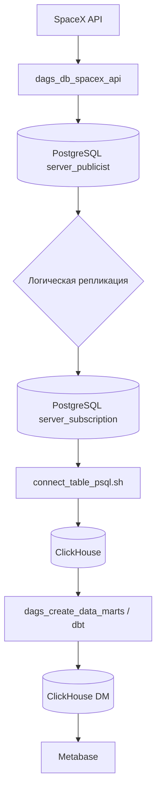

# SpaceX ETL

Репозиторий демонстрирует работу ETL-пайплайна по загрузке и преобразованию данных о запусках SpaceX. Проект развёрнут на базе Apache Airflow и использует PostgreSQL, ClickHouse, dbt и Metabase.

## Структура проекта

- `airflow/` – DAG-файлы Airflow.
  - `dags_db_spacex_api.py` – загрузка данных из публичного API SpaceX и сохранение их в PostgreSQL `server_publicist`.
  - `dags_create_data_marts.py` – запуск dbt для построения витрин в ClickHouse.
- `postgres/` – скрипты инициализации двух серверов PostgreSQL: `server_publicist` (источник) и `server_subscription` (подписчик логической репликации).
- `clickhouse/` – скрипт `connect_table_psql.sh` подключает таблицы ClickHouse к реплицированной базе PostgreSQL через движок `PostgreSQL`.
- `dbt/` – проект dbt с моделями и макросами для формирования витрин данных в ClickHouse.
- `metabase/` – Dockerfile и драйвер для подключения Metabase к ClickHouse.
- `docker-compose.yaml` – конфигурация окружения для локального запуска всех сервисов.
- `Dockerfile` – образ Airflow с установленными зависимостями.
- `requirements.txt` – список Python-зависимостей проекта.

```text
spacex_etl/
├── airflow/
│   └── dags/
│       ├── dags_db_spacex_api.py
│       ├── dags_create_data_marts.py
│       ├── entities.py
│       └── utils.py
├── clickhouse/
│   └── ch_command/
│       └── connect_table_psql.sh
├── dbt/
│   └── spacex/
│       ├── dbt_project.yml
│       └── ...
├── postgres/
│   ├── server_publicist/
│   │   └── script_server_publicist.sh
│   └── server_subscription/
│       └── script_server_subscription.sh
├── metabase/
│   ├── Dockerfile
│   └── clickhouse.metabase-driver.jar
├── docker-compose.yaml
├── Dockerfile
└── requirements.txt
```

## Используемые технологии

- **Apache Airflow** – оркестрация ETL-процессов.
- **PostgreSQL** – хранение сырых данных и источник логической репликации.
- **ClickHouse** – аналитическое хранилище, подключённое к PostgreSQL.
- **dbt** – построение витрин данных в ClickHouse.
- **Metabase** – визуализация сформированных витрин.
- **Docker Compose** – оркестрация контейнеров проекта.

## Процесс работы пайплайна

1. **Запуск окружения** – `docker-compose up -d` поднимает PostgreSQL, ClickHouse, Airflow, Metabase и вспомогательные сервисы.
2. **Загрузка данных** – DAG `dags_db_spacex_api` получает данные из API SpaceX и сохраняет их в базу `server_publicist`.
3. **Логическая репликация** – данные из `server_publicist` автоматически реплицируются в `server_subscription`, откуда их читает ClickHouse.
4. **Подключение ClickHouse** – скрипт `connect_table_psql.sh` создаёт таблицы ClickHouse с движком `PostgreSQL` и указывает на `server_subscription`.
5. **Построение витрин** – DAG `dags_create_data_marts` выполняет `dbt run`, формируя представления и отчётные таблицы в ClickHouse.
6. **Анализ данных** – Metabase подключается к ClickHouse и позволяет строить дашборды на основе витрин.

Все переменные подключения (пароли, URL и т.д.) задаются через Airflow Variables.

## Схема пайплайна


